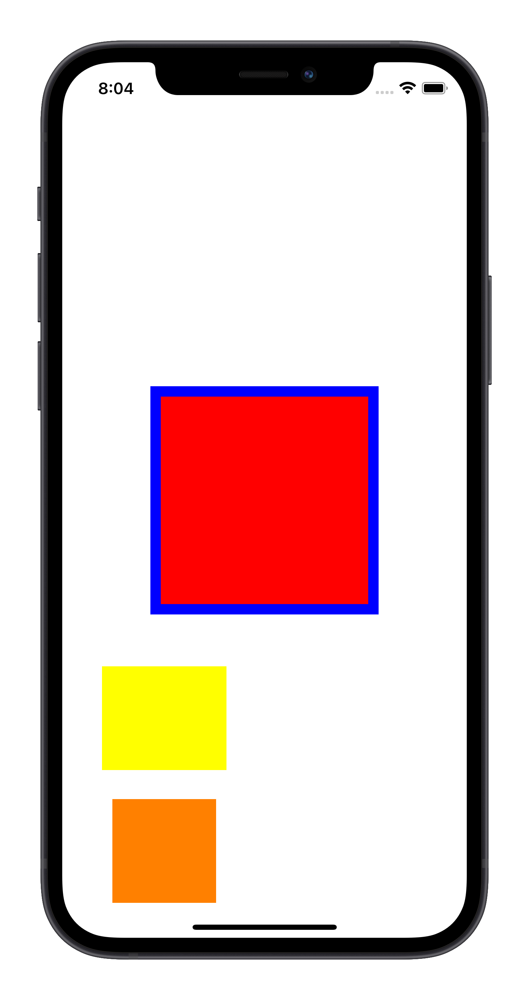

# Constraint Builder


[](https://img.shields.io/badge/license-MIT-green)
[](https://swift.org)
[](https://img.shields.io/badge/coverage-97.4%25-green?style=flat)
[](https://img.shields.io/github/stars/SimeonRumy/constraints?style=social)


<!-- PROJECT LOGO -->
<br />
<div align="center">
  <a href="https://github.com/SimeonRumy/constraints">
    
  </a>

<h3 align="center">Constraint Builder</h3>

  <p align="center">
    A simple Auto Layout DSL
    <!-- <br />
    <a href="https://github.com/github_username/repo_name"><strong>Explore the docs »</strong></a>
    <br /> -->
    <br />
    <!-- <a href="https://github.com/SimeonRumy/constraints">View Demo</a>
    · -->
    <a href="https://github.com/SimeonRumy/constraints/issues">Report Bug</a>
    ·
    <a href="https://github.com/SimeonRumy/constraints/issues">Request Feature</a>
  </p>
</div>


<!-- TABLE OF CONTENTS -->
<details>
  <summary>Table of Contents</summary>
  <ol>
    <li>
      <a href="#about-the-project">About The Project</a>
    <li><a href="#usage">Usage</a></li>
        <ul><a href="#alignment">Alignment</a></ul>
        <ul><a href="#size">Size</a></ul>
        <ul><a href="#Batching and Activating Constraints">Batching and Activating Constraints</a></ul>
    <li><a href="#license">License</a></li>
    <li><a href="#contact">Contact</a></li>
    <li><a href="#acknowledgments">Acknowledgments</a></li>
  </ol>
</details>


## About The Project

This DSL aims to make writing and reading constraints more intuitive by making intent clear and removing boilerplate code. Result builders are used to make constraint batching and activation easier and more efficient.

A single constraint can be defined like so:

```swift
view.bottom == 4 * button.top + 10 
```


 This is similar to the internal <strong>linear</strong> representation as discussed by Apple. From the [Apple documentation](https://developer.apple.com/library/mac/documentation/AppKit/Reference/NSLayoutConstraint_Class/NSLayoutConstraint/NSLayoutConstraint.html):

> Each constraint is a linear equation with the following format:
>
> `item1.attribute1 = multiplier × item2.attribute2 + constant`

## Quick Motivational Example

Tired of this?


```swift
NSLayoutConstraint.activate([
    view.centerYAnchor.constraint(equalTo: view1.centerYAnchor),
    view.centerXAnchor.constraint(equalTo: view1.centerXAnchor),
    view1.heightAnchor.constraint(equalToConstant: 200),
    view1.widthAnchor.constraint(equalToConstant: 200),
    view2.topAnchor.constraint(equalTo: view1.topAnchor, constant: -10),
    view2.bottomAnchor.constraint(equalTo: view1.bottomAnchor, constant: 10),
    view2.leadingAnchor.constraint(equalTo: view1.leadingAnchor, constant: -10),
    view2.trailingAnchor.constraint(equalTo: view1.trailingAnchor, constant: 10),
    view3.bottomAnchor.constraint(equalTo: view.safeAreaLayoutGuide.bottomAnchor),
    view3.heightAnchor.constraint(equalTo: view1.heightAnchor, multiplier: 0.5),
    view3.widthAnchor.constraint(equalTo: view1.widthAnchor, multiplier: 0.5),
    NSLayoutConstraint(item: view3, attribute: .centerX, 
                        relatedBy: .equal, toItem: view1, 
                        attribute: .trailing, multiplier: 1/3, constant: 0),
    view4.trailingAnchor.constraint(equalTo: view3.trailingAnchor, constant: 10),
    view4.leadingAnchor.constraint(equalTo: view3.leadingAnchor, constant: -10),
    view4.topAnchor.constraint(equalTo: view2.bottomAnchor, constant: 50),
    view4.heightAnchor.constraint(equalToConstant: 100),
])
```

Try this instead:



```swift
Constraints {
    view.centerXY == view1.centerXY
    view1.size == 200
    view2.edges == view1.edges 
        + UIEdgeInsets(top: 10, left: 10, bottom: 10, right: 10)
    view3.bottom == view.safeAreaLayoutGuide.bottom
    view3.size == view1.size / 2
    view3.centerX == view.trailing / 3
    view4.horizontalEdges == view3.horizontalEdges 
        + UIEdgeInsets(left: 10, right: 10)
    view4.top == view2.bottom + 50
    view4.height == 100
}.activate()
```


## Usage 

### Basic Anchors

Constraint Builder provides a wrapper over the LayoutAnchor API. Basic anchors consist off:

* top
* bottom 
* leading
* trailing
* centerX
* centerY
* height 
* width
* left
* right
* firstBaseline
* lastBaseline

### Composite Anchors

Composite Anchors combine together basic anchors, enabling setting multiple constraints at once.

| Composite     | Basic Anchors |
| ------------- |---------------|
size            | width, height
centerXY        | centerX, centerY
horizontalEdges | leading, trailing
verticalEdges   | top, bottom
edges           | leading, trailing, top, bottom


### Relations

Relations are expressed using swift operators:

```swift
== // NSLayoutConstraint.Relation.equal
=> // NSLayoutConstraint.Relation.greaterThanOrEqual
<= // NSLayoutConstraint.Relation.lessThanOrEqual   
```
 
### Alignment

#### Aligning Edges

```swift
button.leading == button2.trailing + 10   
button.leading - 10 == button2.trailing 
button.leading == 10 + button2.trailing
// these expressions result in equivalent constraints
```

The same mathematical rules apply to multipliers which allow us to express relative alignment:

```swift
button.leading == 2 * button2.trailing / 3 
```

#### Centering Views

```swift
view.centerY == superview.centerY
view.centerX == superview.centerX
// or using the composite anchor - centerXY:
view.centerXY == superview.centerXY
```

#### Fill superview

```swift
view.top == superview.top
view.bottom == superview.bottom
view.leading == superview.leading
view.trailing == superview.trailing

// or using composite anchors - edges:
view.horizontalEdges == superview.horizontalEdges
view.verticalEdges == superview.verticalEdges

// in one go:
view.edges == superview.edges
```

Note: composite edge anchors use leading and trailing anchors under the hood because those are recommended as the default choice.

#### Insets with composite anchors

Composite Anchors also support setting insets.

```swift
view1.edges == view2.edges + UIEdgeInsets(top: 10, left: 10, bottom: 10, right: 10)
view1.horizontalEdges == 10
view1.horizontalEdges == view2.horizontalEdges + UIEdgeInsets(left: 10, right: 10) 
// this DSL provides a shortened init method
```

### Size

Constrain views to be the same size:

```swift
button.height == button2.height
button.width == button2.width

// or using composite anchor - size:
button.size == button2.size 
button.size == button2.size * 2 // make button1 twice the size of button2
```

Set fixed size:

```swift
button.height == 100
button.width == 200

// or  with composite anchor - size:
button.size == CGSize(width: 200, height: 100)
button.size == 100 // square
```

### Batching and Activating Constraints

Constraints are not activated individually by default because that is not efficient and can slow down view rendering. Multiple constraints should be activated using ```NSLayoutConstraint.activate([])``` according to Apple.

Therefore, we need an intuitive way to batch and activate constraints.


```swift
button.height == 100 // returns NSLayoutConstraint
button.size == 100 // returns [NSLayoutConstraint]
```

#### Batching

Constraint Builder uses Results Builders to provide a simple API to batch together single constraints with arrays of constraints returned my composite anchors.

```swift
Constraints {
    button.height == 100 // returns NSLayoutConstraint
    button.size == 100 // returns [NSLayoutConstraint]
} // Builds result implicitly and returns [NSLayoutConstraint]
```

#### Activation

You can activate an individual or an array of constraints using the ```.activate()``` method. 
This uses ```NSLayoutConstraint.activate([])``` under the hood ensuring performance. 


```swift
Constraints {
    mapView.size == 200 ~ .required
    mapView.centerXY == view.centerXY
    view.centerX == view2.centerX
    mapView.bottom == view2.top - 10
    view2.size == mapView.size / 2
}.activate()
```

Result builders also allow us to include additional control flow within the closure. 

```swift
Constraints {
    if somethingIsTrue {
        mapView.size == 200 ~ .required
        mapView.centerXY == view.centerXY
    } else {
        view.centerX == view2.centerX
    } 
    Constraints {
        mapView.bottom == view2.top - 10
        view2.size == mapView.size / 2
    }.priority(.required)

}.activate()
```


### Priority

Set priority on individual constraints using ```~``` operator
```swift
view1.top == view2.top + 20 ~ .required
view1.bottom == view2.bottom + 20 ~ .priority(500) // set custom priority
view1.trailing == view2.trailing + 20 ~ .almostRequired
```

Furthermore ```.priority()``` method can be called on  arrays and individual constraints.

## Installation

Install using [Swift Package Manager](https://github.com/apple/swift-package-manager)

## Contact

Simeon Rumyannikov
* [Linked-in](https://www.linkedin.com/in/simeon-rumyannikov/)
* Email: simeonrumyannikov@gmail.com

## License

This project is shipped under the MIT license


## Acknowledgments

* [Swift by Sundell: Building DSLs in Swift](https://www.swiftbysundell.com/articles/building-dsls-in-swift/)
* [SwiftAutoLayout Package](https://github.com/indragiek/SwiftAutoLayout)
* [Anchorage Package](https://github.com/Rightpoint/Anchorage)
* [Cartography Package](https://github.com/robb/Cartography)


<p align="right">(<a href="#readme-top">back to top</a>)</p>


## Notes


Introduced in Swift 5.4 result builders (also known as function builders) allow you to build up a result using 'build blocks'.

This package uses result builders to create a 'Constraints Builder' which takes multiple NSLayoutConstraint and outputs an array of NSLayoutConstraints.

```swift

Constraints {
    view.heightAnchor.constraint(equalTo: view2.heightAnchor, multiplier: 1)
    view.widthAnchor.constraint(equalToConstant: 200)
    view.centerXAnchor.constraint(equalTo: view2.centerXAnchor)
    view.centerYAnchor.constraint(equalTo: view2.centerYAnchor)
}

```


Using included extensions on NSLayoutConstraint we can activate constraints all at once and add priority.

```swift

Constraints {
    view.heightAnchor.constraint(equalTo: view2.heightAnchor, multiplier: 1)
    view.widthAnchor.constraint(equalToConstant: 200)
    view2.centerXAnchor.constraint(equalTo: view.centerXAnchor).setPriority(999)
    
}.activate()


```

An alternative way is to create an array of constraints instead.

```swift

[
    view.heightAnchor.constraint(equalTo: view2.heightAnchor, multiplier: 1),
    view.widthAnchor.constraint(equalToConstant: 200),
    view2.centerXAnchor.constraint(equalTo: view.centerXAnchor).setPriority(999),
    
].activate()


```

Using function builders offers 3 minor advantages.

1. No need to keep track of commas. Can be annoying when adding a lot of constraints.
2. The keyword 'Constraints' allows us to quickly find the constraints using Cmd+F.
3. Opens up further potential for improving the way constraints configured.


I have built a fully functional and tested Auto Layout with some of Swifts newest features, documenting the process. 
